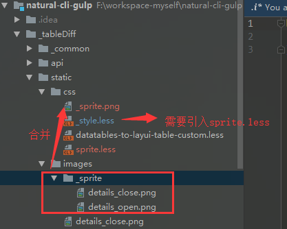

# README

> 配合传统SSM/JavaEE项目的前端脚手架

- 前端技术：gulp + browserSync + jquery + layui(IE8+)

---

# 使用说明

- 工程命名
    
```js 
// 项目命名
以下划线作为开头标志进行命名, 与src保持同级
这样可以管理多个项目 -> 小trick
```

- 运行命令

```shell
// package.json配置命令 
// 传递SYS_NAME这个参数
"dev:tableDiff": "set SYS_NAME=tableDiff && gulp 01-build-dev",
"build:tableDiff": "set SYS_NAME=tableDiff && gulp 03-build-dist",
```

- 工程配置

```
build/config下新建工程同名文件
进行覆盖
```

- 如果使用JSP/Freemarker
    - 禁用html有关任务
    - 调整资源指向
    
```yml
# application-xxx.yml
spring:
  # 资源路径配置
  resources:
    static-locations: classpath:/src/assets/,classpath:/static/
```     

- 引用html片段/cdn 

```html
<!-- 文件的相对路径 -->
@@include("./header.inc")
@@include("../src/include/jquery.useful.js.inc")
```

- 资源编译

    - 工程下新建static文件夹 eg.(_project/static) @attention -> 文件夹下的文件会被特殊处理
    - _project/static/js     -> 缩编/ES6语法转译
    - _project/static/css    -> autoprefix/less支持
    - _project/static/images -> 图片压缩
    - less要编译输出的文件`下划线`开头
    
```jsx
// 引入资源如下 
<script src="/static/js/es6.js"></script>

//  _style.less
@import "../../../src/assets/css/_base/_importAll";
```

- 雪碧图

    

- 字体子集化

```
// 配置命令
"sprite:tableDiff": "set SYS_NAME=tableDiff && gulp 05-make-sprite"

// 使用
.icon-email {
  .sprite(@icon-email);
}

// @attention
sprite -> dev(需要重启)
合成的雪碧图会拷贝到编译目录
```    
    
- pwa

    - 安全域： localhost 或者 https
    - 如果直接没成功起来，试着注册一下

```html
<script>
  if ('serviceWorker' in navigator) {
      // 为了保证首屏渲染性能，可以在页面 load 完之后注册 Service Worker
      window.onload = function () {
          navigator.serviceWorker.register('/sw.js');
      };
  }
</script>
```
    
# 目录结构

```
├─_project 工程前加下划线 "_"标识
├─build 构建系统
│  ├─config
│  │  └─system 
│  │      └─melt.js 优先级覆盖 melt.js > index.js
│  │  └─index.js 主要的配置文件
│  └─tasks 各种功能任务
│  
├─public 可以配成CDN的静态资源
│  ├─fonts
│  │  ├─font-awesome
│  ├─plus 按melt=M+E+L+T分类
│  │  ├─effects
│  │  ├─ie
│  │  ├─layout
│  │  ├─model
│  │  └─toolbox
│  └─vendor
│      └─jquery
├─src 开发目录
│  └─assets
│      ├─css 公用CSS
│      ├─images 公用图片
│      │  └─common
│      │      └─emoji
│      └─libs 公用脚本库
│          └─mumuy
├─static 编译生成的静态资源(打包的话也包括CDN)
└─templates
```  

  

# 注意

- 新增/删除文件 要重启项目

---

# TODO

- gulp-changed 仅发生变化的 提高性能
- cdn路径替换功能
- 照着tmt-workflow结构优化一波
- 公共库的提取
- 前端权限
- 前端简易路由
- 模块化与异步
- less报错终止??    

# 部署到centos

- (阿里云)配置安全组
- 打开防火墙规则

```shell 
# 防火墙开放
iptables -I INPUT 4 -p tcp -m state --state NEW -m tcp --dport 3306 -j ACCEPT
service iptables save
iptables -nvL // 查看规则
```

- gulp 生成软链接 
    - 可能需要全局安装一下browserSync

```shell
unzip dist.zip -d ./dist
npm install -g browser-sync
npm install -g gulp
npm install -D gulp


ln -s /root/node-v6.9.5-linux-x64/bin/gulp /usr/local/bin/gulp
gulp -v

serve 一样生成软link
http://47.100.99.127:5000
```

- 运行

```shell
# 端口配置了 8033
nohup gulp distSync &
open http://47.100.99.127:8033/ch4-corner/index.html (headless无法自动打开)
```
